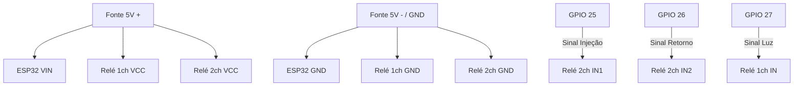

# Diagrama de Fiação: Prateleira VitroCeres (Válvulas e Relés Mecânicos)

Este documento descreve como conectar o **ESP32** aos módulos de relé mecânico (1 canal e 2 canais) para controlar as válvulas solenoide e a iluminação.

## Componentes Utilizados
1.  **ESP32 DevKit V1** (ou similar).
2.  **Módulo Relé 1 Canal 5V** (Foto `image-13.png`).
3.  **Módulo Relé 2 Canais 5V** (Foto `image-12.png` - com jumper High/Low Level Trigger).
4.  **Fonte 5V / 2A** (Alimentação do ESP32 e Relés).
5.  **Fonte para Válvulas** (Ex: 12V ou 24V conforme a solenoide utilizada).

---

## 1. Conexões Lógicas (GPIOs)

| Função | Pino ESP32 | Módulo Relé | Descrição |
| :--- | :--- | :--- | :--- |
| **Injeção (V1 + V4)** | **GPIO 25** | IN1 (Módulo 2 canais) | Abre as válvulas de entrada de solução. |
| **Retorno (V2 + V3)** | **GPIO 26** | IN2 (Módulo 2 canais) | Abre as válvulas de saída/dreno. |
| **Luzes** | **GPIO 27** | IN (Módulo 1 canal) | Aciona a fita de LED ou lâmpadas da prateleira. |

---

## 2. Diagrama de Fiação (Esquemático)

### Alimentação do ESP32 e Relés
> **IMPORTANTE:** Os módulos de relé mecânico operam em **5V** e o sinal do ESP32 é **3.3V**. Embora muitos módulos de relé 5V com optoacoplador (como os das fotos) funcionem com 3.3V, se você encontrar instabilidade no disparo, **vai precisar de transistores BC337** para acionar o sinal de 5V a partir do GPIO de 3.3V do ESP32.

### Ligação das Válvulas (Potência)
As válvulas devem ser ligadas no terminal **Comum (COM)** e **Normalmente Aberto (NO)** dos relés.

1.  **Par de Injeção (V1 e V4):**
    *   Ligue os fios positivos de V1 e V4 juntos ao **NO** do Relé 1 (do módulo de 2 canais).
    *   Ligue o **COM** do Relé 1 ao positivo da fonte de 12V/24V.
    *   Os fios negativos de V1 e V4 vão direto ao negativo da fonte de 12V/24V.

2.  **Par de Retorno (V2 e V3):**
    *   Ligue os fios positivos de V2 e V3 juntos ao **NO** do Relé 2 (do módulo de 2 canais).
    *   Ligue o **COM** do Relé 2 ao positivo da fonte de 12V/24V.
    *   Os fios negativos de V2 e V3 vão direto ao negativo da fonte de 12V/24V.

---

## 3. Configuração do Jumper (Módulo 2 Canais)
O módulo de 2 canais (Foto `image-12.png`) possui um jumper para selecionar o tipo de gatilho (**High** ou **Low**).

*   **Para o Firmware v2.5.3 (Padrão):**
    *   O firmware está configurado como `RELAY_ACTIVE_LOW = true`.
    *   Coloque o jumper na posição **LOW**. Isso significa que quando o GPIO do ESP32 for para nível BAIXO (GND), o relé liga.
*   **Vantagem do Active Low:** O ESP32 inicia os pinos em HIGH no boot, evitando que os relés "pisquem" ou liguem sozinhos ao ligar a energia.

---

## 4. Dicas de Segurança e Ruído
*   **Diodos de Proteção:** Se estiver usando válvulas solenoide DC, é altamente recomendável colocar um diodo (ex: 1N4007) em paralelo com os fios da válvula (catodo no positivo) para evitar que o "coice" indutivo trave o ESP32.
*   **Fonte Separada:** Tente usar uma fonte de boa qualidade para o ESP32. Se as válvulas forem 110V/220V AC, mantenha os fios de força longe dos fios de sinal do ESP32.

---
**Versão da Documentação:** 1.0.0
**Compatível com Firmware:** v2.5.3+
